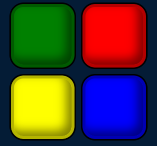

# Simon Game

一个经典的 Simon 记忆游戏的网页实现版本。玩家需要记住并重复电脑随机生成的按键序列，每次成功后难度会逐渐增加。

## 游戏演示

<p align="center">
  
</p>

## 功能特点

- 经典的四色按钮界面
- 渐进式难度系统
- 声光反馈效果
- 响应式设计，适配各种屏幕尺寸
- 优雅的动画效果

## 技术栈

- HTML5
- CSS3
- JavaScript (ES6+)
- jQuery
- Web Audio API

## 快速开始

1. 克隆仓库
```bash
git clone https://github.com/practicenotes007/Simon.git
```

2. 进入项目目录
```bash
cd Simon
```

3. 安装依赖
```bash
npm install
```

4. 启动本地服务器
```bash
npm start
```

5. 在浏览器中访问 `http://localhost:8080`

## 部署

### 开发环境

1. 安装开发依赖
```bash
npm install
```

2. 启动开发服务器
```bash
npm start
```

3. 生成文档
```bash
npm run docs
```

### 生产环境

1. 确保所有依赖已安装
```bash
npm install --production
```

2. 部署到静态文件服务器
   - 将以下文件复制到服务器：
     - index.html
     - styles.css
     - simon.js
     - sounds/
     - images/
     - node_modules/jquery/dist/jquery.min.js

## 依赖项

### 生产依赖
- jQuery: DOM 操作和事件处理

### 开发依赖
- http-server: 本地开发服务器
- JSDoc: 文档生成工具

## 游戏规则

1. 按任意键开始游戏
2. 观察并记住电脑自动按下的按钮顺序
3. 重复相同的按钮顺序
4. 每次成功后，序列会增加一个新的按钮
5. 如果按错或超时（2秒）未按，游戏结束
6. 游戏结束后可以重新开始

## 项目结构

```
simon-game/
│
├── index.html         # 主页面
├── styles.css         # 样式表
├── simon.js           # 游戏逻辑
|── images/            # 图片文件
|   └── simon.PNG
├── sounds/            # 音效文件
│   ├── blue.mp3
│   ├── green.mp3
│   ├── red.mp3
│   └── yellow.mp3
└── README.md
```

## 开发

### 生成文档

项目使用 JSDoc 进行文档生成。运行以下命令生成文档：

```bash
npm run docs
```

生成的文档将保存在 `docs/` 目录下。

### 代码风格

- 使用 ES6+ 特性
- 遵循模块化设计原则
- 使用 JSDoc 注释规范

## 贡献

欢迎提交 Pull Request 或创建 Issue！

## 许可证

本项目采用 MIT 许可证 - 查看 [LICENSE](LICENSE) 文件了解详情

## 致谢

- 感谢 [Press Start 2P](https://fonts.google.com/specimen/Press+Start+2P) 字体
- 感谢所有贡献者和测试者

## 作者

[practicenotes007] - [practicenotes@163.com]

## 版本历史

- 0.1.0
    - 初始发布
```

